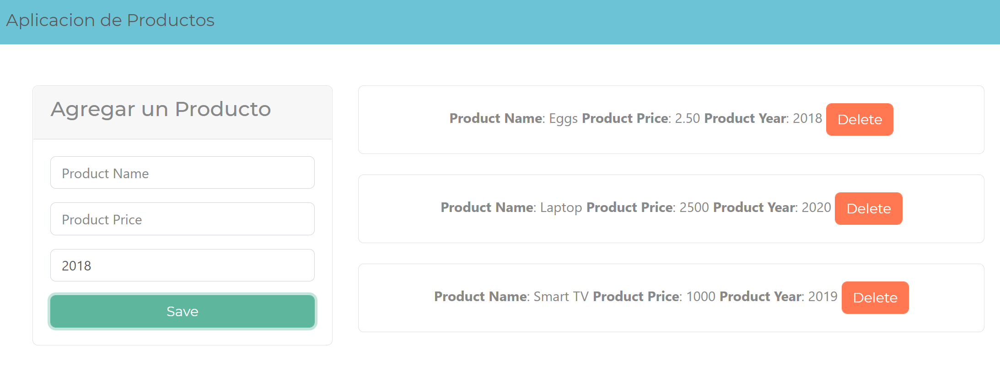

# Products App

## Description

This is a simple Vanilla JavaScrip Aplication. A CRUD of products using OOP (Object Orientend Programming).

## Features

- Create a Product
- List Products
- Delete a Product
- Form Inputs Validations

## How to Install

1. Clone the repository
2. Open the Proyect
3. Run the index.html file

## Technologies

- Javascript
- CSS
- HTML5
- Bootstrap 4
- [Bootswatch.com](https://bootswatch.com)
- Git

## Screenshoots

